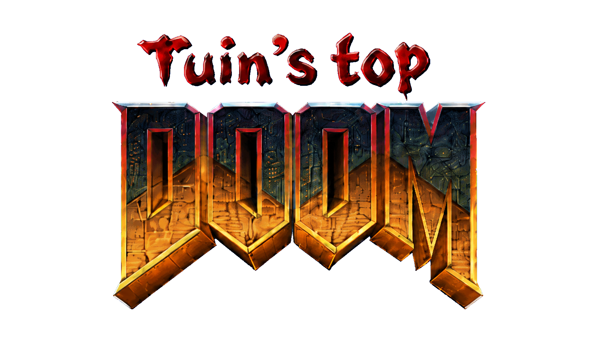

# Tuin's Top Doom



An experimental isometric/top-down action RPG conversion for classic Doom,
powered by a customized UZDoom renderer.

> **Experimental release:** gameplay, balance and renderer behavior are still
> being tuned. Keep saves made with different versions separate.

## Download and play

Download the latest Windows ZIP from
[GitHub Releases](https://github.com/tuin-boop/doom-top-mode/releases),
extract the whole folder, and double-click **`DoomTopModeLauncher.exe`**.

The launcher:

- presents a visible launch window with the detected IWAD and Voxel Doom state;
- prevents duplicate Top Doom sessions when the launcher is clicked repeatedly;
- uses the bundled customized UZDoom renderer and `DoomTopMode.pk3`;
- searches common Steam, GOG and Doom environment-variable locations;
- opens a file picker if it cannot find `DOOM2.WAD` or `DOOM.WAD`;
- remembers the selected legal IWAD without copying it into the release;
- automatically loads `VoxelDoom*.pk3` when placed beside the launcher, in an
  `addons` folder, or in the user's Downloads folder.

Voxel Doom is enabled by default when detected because it is central to the
intended look. It can add roughly 30–60 seconds while UZDoom converts voxel
frames into renderable geometry. The launcher remains visible with a loading
indicator during that work; disabling voxels is mainly useful for diagnosis.

Commercial Doom IWADs and Voxel Doom are **not redistributed**.

## Current prototype

- Orthographic isometric follow camera
- Screen-relative WASD movement
- Mouse-directed facing
- Sticky visible-monster aim assist with smooth automatic player turning
- Warm, pitch-aware dynamic spotlight flashlight with `F`
- Compact gunmetal tactical HUD with live vitals, armor, ammo, aim and light state
- Aim-lock target card showing monster name and live HP
- Center crosshair disabled; the lock marker follows the selected monster in world space
- Experimental player-centered wall cutout (`N` reliably toggles it with a console confirmation; `r_ortho_wallcutout 0` disables it)
- World-space lock marker attached directly to the selected monster
- 90-degree camera rotation with `Q` and `E`
- Three camera pitches with `V` (35°, 48°, and 60°)
- Camera zoom with `[` and `]`
- Automatic boundary-wall avoidance, toggleable with `B`
- Emergency near-overhead view when every diagonal viewpoint is obstructed
- Custom UZDoom orthographic near-plane cutaway for hiding intrusive boundary walls
- Orthographic sky-dome suppression (the perspective dome otherwise becomes a giant curved texture)
- Aim-assist toggle with `C`
- Camera recenter with `Z`
- Automatic XP and player levelling; every level raises maximum health, damage, armor capacity, and ammo capacity
- Character progression sheet with `L`, shown through a compact black-edged HUD tab
- Levelled monsters normally roll within roughly four levels of the player (a level-1 marine can encounter level-5 monsters); Epic and higher variants can roll three additional levels above that range
- Weapon drops inherit the defeated monster's level, so otherwise similar high-level weapons roll more damage than low-level versions
- Levels grant +5% ammo capacity each, and every monster kill restores a small amount of each ammunition type already carried
- Epic-or-better loot can roll a twin green plasma rifle: it fires two weaker Arachnotron-style bolts for two cells and shares slot `6` with the normal plasma rifle
- Testing cheat: enter `dtm_spawn_dual_plasma` in the console to summon an Epic twin-plasma drop at the player's current level
- Rare-or-better loot can roll a riot shotgun: five lighter pellets in a tight cone with roughly twice the normal shotgun's fire rate; it shares slot `3` with the other shotguns
- Riot shotgun testing cheat: enter `dtm_spawn_riot_shotgun` in the console to summon a Rare drop at the player's current level
- Rare-or-better loot can roll an Uzi with a real 30-round magazine, high burst damage, automatic/`R` reload, and an animated reload HUD; it shares slot `4` with the chaingun
- Uzi testing cheat: enter `dtm_spawn_uzi` in the console to summon a Rare drop at the player's current level
- Epic-or-better loot can roll a Revenant Launcher that consumes rockets and fires fast, super-homing Revenant missiles; it shares slot `5` with the normal rocket launcher
- Revenant Launcher testing cheat: enter `dtm_spawn_revenant_launcher` in the console
- Experimental Baron-form powerup temporarily replaces the visible marine with a Baron body, grants a 1,000-health form, 30% damage resistance, 25% increased damage, 10% movement speed, close-range claws, and Baron fireballs at the monster's native attack cadence for 30 seconds
- Experimental Cyberdemon-form powerup grants a 4,000-health form, 50% damage resistance, 35% increased damage, and the monster's authentic timed three-rocket burst for 30 seconds
- Experimental Revenant-form powerup grants a fast 300-health form with native-timed punches and super-homing Revenant missiles for 30 seconds
- Soulspheres have a 50% chance to become a uniformly random Baron, Cyberdemon, or Revenant form pickup; the remaining 50% stay normal Soulspheres
- Monster-form pickups appear as red-tinted floating megaspheres with distinct infernal glow colors
- Baron-form testing cheat: enter `dtm_spawn_baron_power` in the console
- Cyberdemon-form testing cheat: enter `dtm_spawn_cyber_power` in the console
- Revenant-form testing cheat: enter `dtm_spawn_revenant_power` in the console
- Automatic camera avoidance is disabled by default; `B` enables it when wanted
- Common, Rare, Epic, Mythic, and Godly monster variants with species-fitting names, visible affixes, and distinct Epic-purple, Mythic-gold, and Godly-cyan lighting
- Epic, Mythic, and Godly monsters carry color-coded world glows
- Some Mythic and Godly monsters gain relentless fast-chase behavior
- Rolled weapon drops never auto-pick up: approach one to compare its level and stats with the owned version, then press `E` or Use to equip it without deleting other weapon types
- Rolled rarity, damage and critical stats are retained separately for every collected weapon instead of being overwritten by the next drop
- At 85% kills, one surviving monster is promoted in place into a red-lit boss of its original species and always drops weighted Rare-or-better loot
- Canonical E1M8, E2M8, and E3M8 bosses receive the same boss treatment; bosses have 5x base health, except Cyberdemons and Spider Masterminds at 2.5x
- Optional Cheello Voxel Doom II 2.4 pack, loaded as a separate add-on

## Run from source

First run:

```powershell
.\setup.ps1
```

Then:

```powershell
.\play.ps1
```

Alternatively, double-click `Play Doom Top Mode.bat`. This launcher uses a
process-local PowerShell execution-policy bypass, so it works when `.ps1` files
are blocked without changing the computer's permanent policy.

Use `.\play.ps1 -NoVoxels` to test only the gameplay code.

The development launcher prefers the custom renderer in
`runtime\uzdoom-experimental` and starts
with the projection cutaway disabled. Nearby walls are handled by the dedicated
screen-space wall aperture instead, without clipping floors on maps with large
height changes such as Doom II MAP29.

The legacy projection cutaway remains available for renderer diagnosis:

```powershell
.\play.ps1 -Cutaway 0.15
```

Return it to `0.0` after testing. The custom renderer gives translucent models
the same small depth bias as translucent sprites, preserving their visibility
without clipping tall-map geometry. You can also tune the legacy cutaway live in
the console with `r_ortho_cutaway 0.0`. Use
`.\play.ps1 -StockRenderer` to compare against the
unmodified renderer; on that executable the extra CVar is simply unavailable.

The classic cylindrical Doom sky does not project correctly through this
orthographic camera. The custom renderer therefore skips sky-portal contents in
orthographic views with `r_ortho_hidesky 1`; perspective views remain unchanged.
Use `.\play.ps1 -ShowSky` to compare the original sky rendering.

The complete renderer modification is recorded in
[`renderer/uzdoom-ortho-renderer.patch`](renderer/uzdoom-ortho-renderer.patch)
against UZDoom 5.0.0-rc.3 commit
`4ca590945524330d94530c0558c8d547d457e16c`. It contains the orthographic wall
aperture, translucent sprite/model depth handling, projectile visibility and
sky suppression work used by the release.

The setup script copies an already-installed `DOOM2.WAD` into the ignored
`runtime` directory. Doom's commercial game data is never included in this
repository or in the generated PK3.

## Credits

Camera and aiming implementation adapted from Dileep V. Reddy's CC0
`gzdoom_isometric_demo` and Jay0's Aim Assist Mod v0.8.

Voxel Doom II assets are by Cheello and the Voxel Doom Team and remain a
separately downloaded add-on under their own license. UZDoom is GPLv3+.

See [THIRD_PARTY.md](THIRD_PARTY.md) for source and redistribution details.
